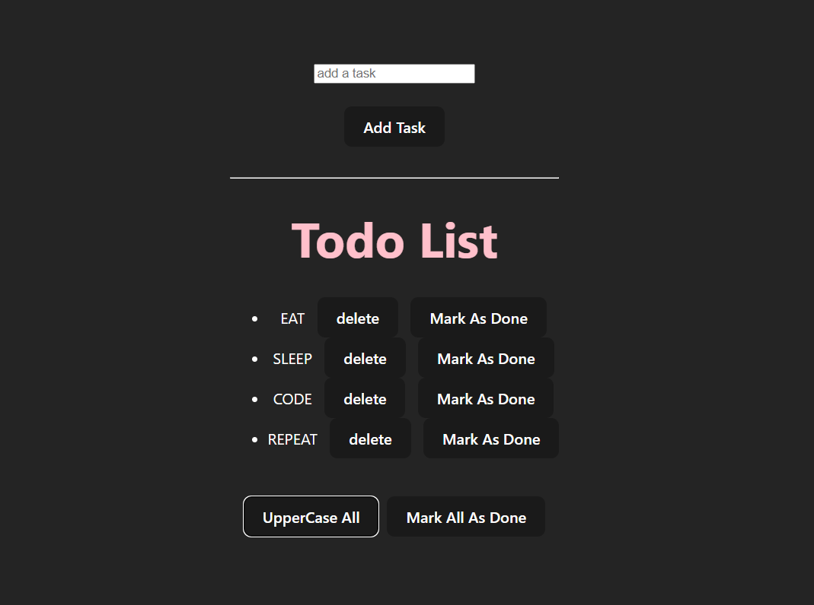

#  React To-Do App  

A modern and feature-rich **To-Do App** built using **React.js** with an enhanced UI and new functionalities such as **uppercase all tasks** and **mark all as done**.  

## Features  

- **Improved UI** – A sleek, dark-themed interface for a better user experience.  
- **Add Tasks** – Users can easily add tasks using the input field and button.  
- **Delete Tasks** – Remove tasks individually when no longer needed.  
- **Mark as Done** – Tasks can be marked as completed.  
- **Uppercase All Tasks** – Convert all tasks to uppercase with a single click.  
- **Mark All as Done** – Mark all tasks as completed instantly.  

## Technologies Used  

- **React.js** – Frontend framework for building the app.  
- **Tailwind CSS** – For styling and responsive design.  
- **JavaScript (ES6)** – For implementing logic.  

## Installation and Usage  

**Clone the repository** - `git clone https://github.com/yourusername/lucky-number-game.git`  
**Navigate** - `cd todo-improved`  
**Install dependencies** - `npm install`  
**Start the development server** - `npm run dev`  
**Open in the browser** - The application will be accessible at `http://localhost:5173`  

## Preview  

  
